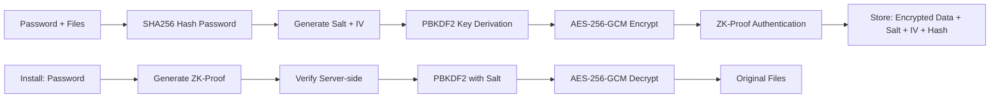
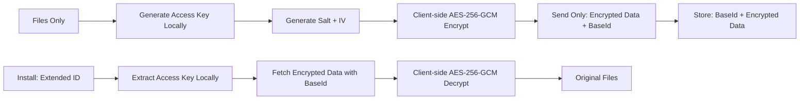

# EnvLink FAQ

## Expiration

What expiration formats are supported?

**Password-Protected EnvLinks:** Support flexible expiration - minutes (m), hours (h), days (d), months (M), years (y), or 'never'. Examples: `30m` for 30 minutes, `24h` for 24 hours, `5d` for 5 days, `6M` for 6 months, `1y` for 1 year, or `never` for permanent links.

**Optional-Password EnvLinks:** Fixed 1-hour expiration for security and convenience.

What is the default expiration time?

**Password-Protected:** 1 day if not specified during creation  
**Optional-Password:** Fixed 1 hour (cannot be changed)

Can I create an EnvLink that never expires?

Yes, use `--exp never` when creating or updating an EnvLink to make it permanent.

What happens to expired EnvLinks?

When manually expired or cleaned up by automatic maintenance, the EnvLink is permanently deleted from the server.

## Security

Is password protection required?

No, password protection is optional. EnvLink supports two types:

**Password-Protected EnvLinks:** Use `envlink create --pass` for enhanced security with explicit password protection.

**Optional-Password EnvLinks (Default):** Use `envlink create` for convenient sharing without password requirements. These expire automatically after 1 hour and use an extended ID format (e.g., el_abc123xyz456accesskey789).

Both types maintain client-side encryption - your data is always encrypted before transmission to the server.

What's the difference between password-protected and optional-password EnvLinks?

| Feature                | Password-Protected           | Optional-Password                 |
| ---------------------- | ---------------------------- | --------------------------------- |
| **Password Required**  | Yes, for all operations      | No password needed                |
| **Server Can Decrypt** | **No** (Zero-knowledge)      | **No** (Zero-knowledge)           |
| **ID Format**          | `el_abc123xyz456`            | `el_abc123xyz456accesskey789`     |
| **Expiration**         | Flexible (minutes to never)  | Fixed 1 hour                      |
| **Update Support**     | Yes (with current password)  | No (install-only after creation)  |
| **Security Level**     | High (Zero-knowledge proof)  | High (Zero-knowledge encryption)  |
| **Use Case**           | Sensitive data, team sharing | Convenient sharing, temporary use |

Both types use client-side encryption and provide complete zero-knowledge security.

Can the server decrypt my data? 🔥 <i>(Most Asked)</i>

**Password-Protected EnvLinks:** **No.** The server uses zero-knowledge proof (ZK-proof) authentication and only stores encrypted data and password hashes. Your password derives the encryption key through PBKDF2, and the server can verify you know the correct password **without ever seeing or storing the password itself**. The server **cannot decrypt your data**.

**Optional-Password EnvLinks:** **No.** These use ultra-clean zero-knowledge encryption where the access key never leaves your machine. The server only stores the encrypted data and a 19-character base identifier. The 16-character access key used for encryption/decryption is embedded in the 35-character extended ID you share, but **never sent to or stored on the server**. The server **cannot decrypt your data**.

Can I add a reference label to my EnvLink?

Yes, use the `--ref` option to add a descriptive label (e.g., "production-api-keys", "staging-db"). This helps organize and identify EnvLinks, especially when managing multiple links.

How is my data secured?

All file content is encrypted using AES-256-GCM encryption before storage. The encryption uses a unique initialization vector (IV) and salt for each EnvLink.

**Password-Protected Security (ZK-Proof Authentication):**

**Optional-Password Security (Client-Side Encryption with Zero Server Knowledge):**

**Server Security Guarantees:**

- **Password-Protected:** Server never stores passwords, encryption keys, or auth tokens - **Cannot decrypt your data**
- **Optional-Password:** Server never stores access keys - **Cannot decrypt your data** (zero-knowledge)
- **Both:** Use AES-256-GCM encryption and PBKDF2 (100,000 iterations)

**🔒 Ultra-Clean Zero-Knowledge:** Both EnvLink types now provide complete zero-knowledge security. Optional-password EnvLinks achieve this by keeping the decryption key client-side only.

## File Limits

How many files can I share in one EnvLink?

You can share up to 10 .env files in a single EnvLink.

What is the file size limit?

Each individual file can be up to 100KB, and the total payload for all files combined cannot exceed 500KB.

What file naming patterns are accepted?

Files must follow the .env naming pattern: `.env` or `.env.{suffix}` where suffix can contain alphanumeric characters, underscores, or hyphens (e.g., .env, .env.local, .env.production).

## Technical

What is the format of an EnvLink ID?

**Password-Protected:** `el_` followed by 16 alphanumeric characters (e.g., `el_abc123xyz456`)

**Optional-Password:** Extended format with 35 total characters: `el_` + 16 chars baseId + 16 chars accessKey (e.g., `el_abc123xyz456accesskey789`)

The extended format embeds the decryption key directly in the ID for zero-knowledge security.

What happens if a file already exists during installation?

EnvLink will detect existing files and prompt you to confirm overwriting them. Files marked as existing will show a warning indicator during the selection process.

## Note:

> **"If EnvLink doesn't resonate with your workflow, that's perfectly fine—you're free to choose what works best for you. But if it does, I hope it makes sharing environment files just a little bit easier and safer for your team."**
>
> — _**envlink** developer team_
